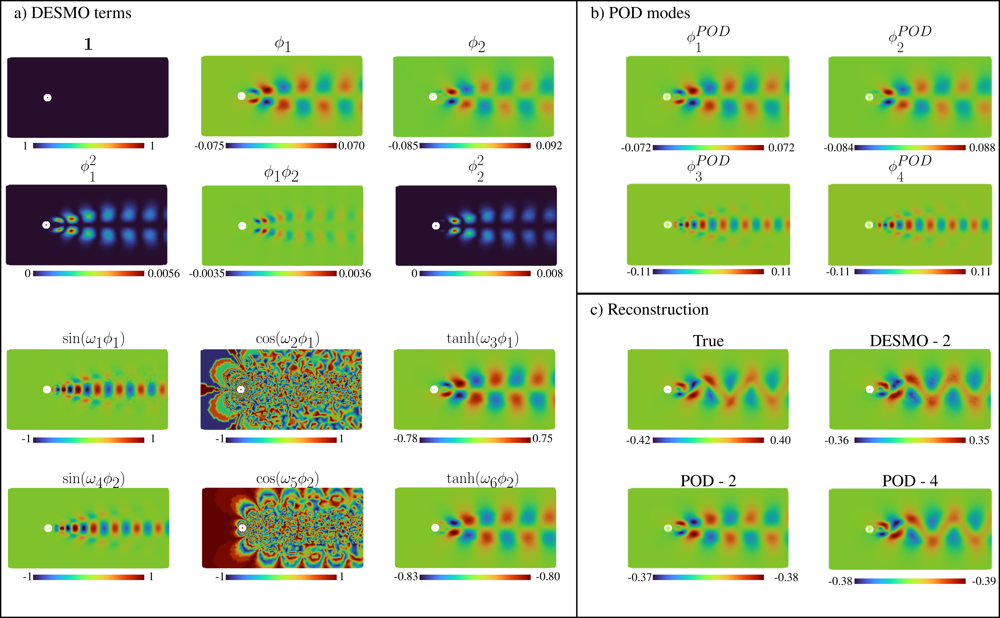

#  DESMO: Decomposed Sparse Modal Optimization

This repository contains the Python implementation for our paper:

**_Decomposed Sparse Modal Optimization: Interpretable Reduced-Order Modeling of Unsteady Flows_**

---

## Repository Overview

This repository contains four different versions of the DESMO framework.

### `DESMO/` —  **Main DESMO Model**
Performs sparse modal optimization using polynomials and nonlinear functions (sin, cos, tanh) to create a modal candidate library.
- `cylinder_flow`: 2D vortex shedding behind a cylinder (Re = 100, periodic)
- `aneurysm`: 3D pulsatile blood flow in a cerebral aneurysm (periodic)
- `turbulent_channel`: 2D slice of turbulent channel flow from the [Johns Hopkins Turbulence Database](https://turbulence.pha.jhu.edu/Channel_Flow.aspx) (non-periodic)

### `DESMO_Fourier/` — **Fourier Expansion Version**
Uses **Fourier series** to model temporal coefficients, only works for **time-periodic** flows.
- `cylinder_flow`
- `aneurysm`

### `DESMO_AE/` — **Autoencoder Version**
Uses an autoencoder to learn latent modal structure directly from data, instead of initializing with POD.
- `cylinder_flow`

### `DESMO_SR/` — **Symbolic Regression Version**
Fits a dynamical system in the form `dz/dt = f(z)` to temporal coefficients via **symbolic regression**.
- `cylinder_flow` (post-processed after DESMO fit)

---

##  Folder Contents

Each test case folder contains:
- `*.py` – Main DESMO implementation script
- `*.pt` – Trained model weights (PyTorch)
- `*.out` – Training logs and loss outputs
- `*.sh` – Shell scripts used to run experiments on HPC systems

---

## Dependencies

Main software packages:
- `pytorch`
- `numpy`
- `vtk`
- `pyvista`
- `pysr` - for the DESMO_SR version only

> ⚠️ Some additional packages may appear in the import section for legacy/intermediate versions, even if not actively used in the final code.

___
  
